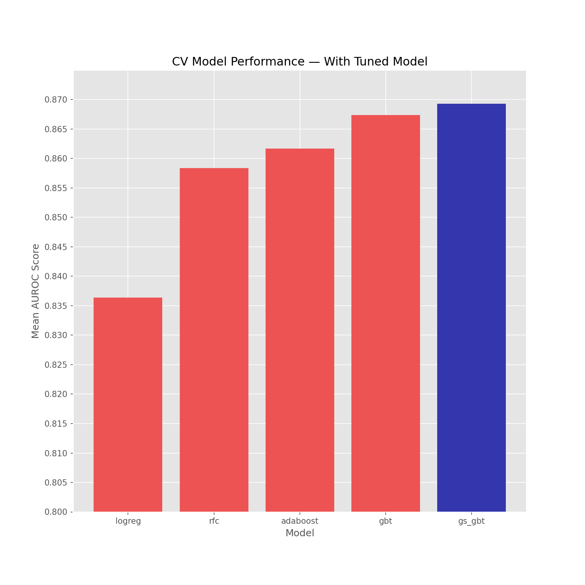
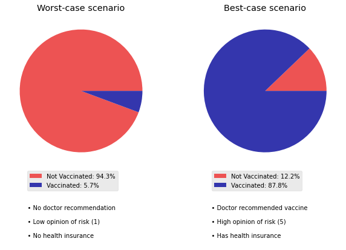

# Predicting Vaccinations Against Infectious Diseases
## Machine learning modeling project
Flatiron School Data Science: Project 3
- **Author**: Zaid Shoorbajee
- **Instructor**: Matthew Bombard
- **Pace**: Flex, 20 weeks

## Overview and Business Understanding

It's part of the role of public health authorities to oversee the production and distribution of vaccines to the public, as well as to inform the public about vaccines' use and effectiveness. Along with the tragedy and global upheaval of the COVID-19 pandemic came the problem of fighting vaccine hesitancy. Someone's decision get or to not get the shot could be influenced by their demographic background, opinions about vaccines, as well as healthcare circumstances.

In this scenario, a public health agency wants to use data and machine learning understand what factors affect someone's decision to get vaccinated. It also wants to be able to predict whether someone will get vaccinated based on those factors. This is an exercise that might aid in vaccination efforts for the current COVID-19 pandemic, but it also can inform efforts to get ahead of the crisis should another epidemic arise.

## Data Understanding

As COVID-19 has consumed the world's collective attention for more than two years, it's easy to forget that the world dealt with another pandemic not too long ago. Although it didn't disrupt world activities the same way COVID-19 has, the H1N1 virus (A.K.A swine flu) was a major cause for concern in 2009 and 2010.

At the time, public health authorities in the U.S. sought to understand more about people's immunization behaviors as a result of the H1N1 outbreak. The Centers for Disease Control and Prevention (CDC) conducted phone surveys, collecting information about whether individuals had gotten the H1N1 and seasonal flu vaccines during the 2009-2010 flu season. The survey also recorded their opinions on the vaccines, viruses, and demographic information.

Machine learning is a good approach to solve this problem because of the extensive amount of variables that can be used to predict the vaccination outcomes. ML algorithms are about to take in a multitude of predictors and learn which ones have the greatest effect on the outcome. The algorithm can use those findings to predict outcomes for data it hasn't seen. These are conclusions would be more limited in scope and time-consuming to reach if one were using a simpler form of statistical analysis.

### Dataset and features
Data from this survey has been made available through a competition hosted by <a href="https://www.drivendata.org/competitions/66/flu-shot-learning/page/210/">DrivenData</a>.

The dataset contains answers from 26,707 survey respondents with 35 features. The features include:
* Behavioral information (E.g. Did respondent bought a face mask? Do they wash their hands frequently?
* Health care information (E.g. Do they have health insurance? Did a doctor recommend they get the seasonal and/or H1N1 vaccine?)
* Demographic information (E.g. age group, education level, race)
* Socioeconomic information (E.g. income level, homeowner status, number of household adults and children)
* Geographic information (Region and whether they live in a metropolitan area)
* Employment information (industry and occupation)

The features are a combination of binary, ordinal, and categorical variables.

#### Missing values:
* There are several features with a large amount of data missing (some close to half). It is far too much to drop rows and columns systematically, so I used an imputation strategy. For numerical variables, I imputed missing values with the mean from that column. For was For categorical vairables, I used scikit-learn's K nearest neigbors imputer.
* Two features, `employment_industry` and `employment_occupation` had half their data missing. The values are encoded in an odd way and are not interpretable, so I dropped only these columns.

### Target variable
The target variables available are two binary variables representing whether the respondent received a seasonal flu vaccine and whether they received an H1N1 vaccine. **This project focuses on one target variable: receiving the H1N1 vaccine.** Thus, the variable indicating receiving the seasonal vaccine was discarded.

### Scoring

The metric I will use to evaluate model performance is the area under the curve of the receiver operating characteristic (AUROC). This is a commonly reported metric that accounts for the true positive rate (TPR) and the false positive rate (FPR). It essentially tells the probability that the model is able to discriminate between positive cases and negative cases. This will probably be more informative than accuracy, since the target set is somewhat imbalanced; about 21% of respondents received the H1N1 vaccine. 

AUROC is also the metric being used to judge the DrivenData competition.

## Modeling

#### In this stage, I ran vanilla (untuned) of several classification models to see which performs best.

For each model I ran a 5-fold cross validation and took a note of the mean AUROC score. I also recorded accuracy scores to make sure nothing was going completely awry (like an accuracy score of less than what a dummy model would predict).

**Here is a summary of each model's CV performance:**

**Logistic Regression**

||train_score|mean_cv_score|
-----------|------|-------
accuracy|0.838992|0.837993
roc_auc|0.839199|0.836371

**Random Forest**

||train_score|mean_cv_score|
-----------|------|-------
accuracy	|0.99995|	0.851623
roc_auc	|1.00000	|0.858384

**Adaboost**

||train_score|mean_cv_score|
-----------|------|-------
accuracy	|0.853520	|0.852521
roc_auc	|0.865581|	0.861693

**Gradient boosted trees (GBT)**

||train_score|mean_cv_score|
-----------|------|-------
accuracy	|0.862856|	0.857564
roc_auc	|0.879027	|0.867416

#### The **gradient boosting classifier** model had the highest AUROC score on the cross-validation.

That is the model I chose in order to tune for better performance. I used scikit-learn's GridSearchCV to try variations of the following parameters of the classifier:

* `n_estimators`
* `max_depth`
* `max_features`

I refrained from using more parameters because the process can get computationally expensive. A few attempts to run the grid search with more parameters took upwards of 20 minutes. 

The best-performing model in the grid search has:
* 150 estimators
* A max depth of 4 nodes
* A max of 20 features (out of 61 after one hot encoding)

## Evaluation

#### The tuned GBT classifier performs marginally better than the untuned one, with an AUROC score of about 0.87 in the cross-validation. This will be final model, which will be evaluated on the test set.

**Tuned GBT (final model):**

||train_score|mean_cv_score|
-----------|------|-------
accuracy	|0.873989	|0.858412
roc_auc	|0.898490	|0.869311

#### This chart compares the performance of all the models so far:

     
### Test score of final model:
I included multiple additional metrics for reference, which I will discuss further in the conclusions.

|	|score|
|-|-|
|accuracy	|0.842744|
|precision	|0.695652|
|recall	|0.478775|
|f1	|0.567189|
|roc_auc	|0.853698|

#### Final model performance and evaluation:

The final model has an **AUROC score of about 0.8537**. 85.37% of the time, the model will assign a higher probability to someone who received the vaccine than to someone who didn't.

This model is a **gradient boosted trees algorithm**, which is designed to essentially learn from its mistakes. Each subsequent learner is trained on the residuals of the previous learner. The algorithm incorporates gradient descent in order to minimize loss.

The predictor that has the most influence on the model is whether or not someone received a **doctor's recommendation** to take the vaccine. As seen in the chart below, other influential predictors include an individual's **opinion about the risk H1N1 poses to them**, as well as whether they have **health insurance**.

### Feature importances

**Below I examine the top 3 predictors even further. Drawing from the entire dataset, the effect that a doctor's recommendation, perception of risk, and health insurance all have on the outcome is clear.**

**To really drive these findings home, here are what the best- and worst-case scenarios look like in terms of the top three predictors.**

**There is a stark contrast in likelihood of getting vaccinated between people who:**

**a) did not get a doctor's recommendation, don't think the virus is a risk to themselves, and don't have health insurance**

versus people who:

**b) got a doctor's recommendation to get vaccinated, view the virus as a high risk to the themselves, and have health insurance.**

## Conclusions
### Recommendations

The stakeholder, a public health agency, should take the following measures in order to fight vaccine hesitancy. These recommendations are based on features that the model predicts are most indicative of whether someone will get vaccinated. 

* **Doctor's orders:** Instruct doctors and health practitioners to recommend disease-preventing vaccines. Even in a pandemic, the model shows that someone is far less likely to get vaccinated if they haven't gotten a doctor's recommendation. 

* **PSAs:** Raise public awareness about the risks of the virus. The model is able to use someone's opinions about the virus to predict whether they will take a vaccine. People are more likely to get vaccinated if they view an infectious virus as a risk to themselves. 

* **Access**: Increase access to healthcare and ensure that vaccines are available for free even to those who don't have coverage. The model is less likely to predict that someone got the vaccine if they don't have health insurance. It's important to remove this obstacle and ensure that the public is aware of the vaccine's availability.

### Next steps

Are these findings generalizable to other public health crises? The data used in this analysis pertains to the swine flu pandemic, which ended more than a decade ago. It might be beneficial to find similar data about the current COVID-19 pandemic to see if the the findings would be similar. Public health communication about COVID-19 has arguably been more pervasive than for the swine flu. It's possible that that has had an effect on vaccination rates when compared to swine flu.

### Limitations
For comparison, I included various additional metric scores with the test set results. Of note, the final model has a recall score of 0.4788. This means that of all people who did in fact get the vaccine, the model will correctly predict them as positive cases 47.88% of the time. This is rather low. However, in the context of life-saving vaccines it is probably better to undercount the vaccinated. This way a public health authority will end up targeting more of the general population with pro-vaccine messaging and access, and hopefully capturing more of the unvaccincated population.
